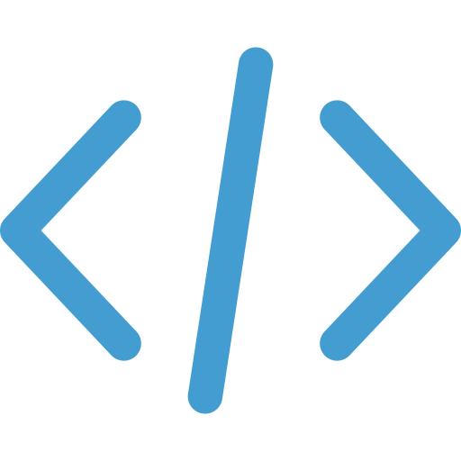

<div align = "center" id = "top">



</div>

<div align = "center">

# <a href="https://iuri-almeida.github.io/" target="_blank" class = "portifolioLink">Iuri Almeida</a>

</div>

<div align = "center">


</div>

<br />

<div align = "center">


</div>

<br />

<div>

## 📌 &nbsp; Descrição

<p>

E aí galerinha, como vcs estão? 😄

Sejam bem vindos e bem vindas ao repositório do meu portifólio. A página está disponível [neste link][portifolio].

Espero que gostem 💙

</p>

</div>

<br />

<div>

## 🛠 &nbsp; Linguagens e Ferramentas

<span>Todas as linguagens e ferramentas que foram usadas na criação da página:</span>

[][vscode]

[][html]

[][css]

[][js]

[][github]

[][reactjs]

[][git]

</div>

<br />
<br />
<br />

<div>

## ⚠️ &nbsp; Requisitos

<span>Antes de clonar esse respositório, é preciso que vc tenha o [Git][git] e o [NodeJS][nodejs] pré-instalados na sua máquina. Segue os comandos para baixar 😊</span>

```bash
# Git
$ git --version # macOS
$ sudo apt install git-all # Ubuntu

# NodeJS
$ brew install node # macOS
$ curl -fsSL https://deb.nodesource.com/setup_current.x | sudo -E bash - sudo apt-get install -y nodejs # Ubuntu
```

**Obs.:** Para o MS Windows vc pode baixar o executável do [Git][git4windows] e do [NodeJS][nodejs].

</div>

<br />

<div>

## 👨🏻‍💻 &nbsp; Executando

<span>Depois de ter baixado todos os requisitos e ter corrido tudo certo, está na hora dos passos para vc poder ter esse repositório na sua máquina e até contribuir 💙</span>

```bash
# clone o repositório
$ git clone https://github.com/Iuri-Almeida/Iuri-Almeida.github.io.git

# Entre no diretório
$ cd Iuri-Almeida.github.io

# Instale todas as dependências
$ npm install ou yarn add

# Inicie o projeto
$ npm start ou yarn start

# A página estará rodando em http://localhost:3000/ por padrão
```

</div>

<br />

<div>

## 💡 &nbsp; Roadmap

<div class = "roadmapList">

- [ ✅ ] &nbsp; Criar a página
- [ ✅ ] &nbsp; Adicionar seção de apresentação
- [ ✅ ] &nbsp; Disponibilizar meu currículo para download
- [ ✅ ] &nbsp; Adicionar responsividade para celular
- [ ✅ ] &nbsp; Adicionar modo claro e escuro
- [ ✅ ] &nbsp; Criar popup para download de currículos
- [ ✅ ] &nbsp; Adicionar seção de hobbies
- [ ❌ ] &nbsp; Criar o menu hambúrguer
- [ ❌ ] &nbsp; Adicionar seção de ferramentas e linguagens
- [ ❌ ] &nbsp; Adicionar seção de projetos

</div>

</div>

<br />

<div>

## 👋🏻 &nbsp; Prazer

<span>Minhas redes socias caso queira entrar em contato 👀</span>

[][instagram]
[][linkedin]
[](mailto:iurilopesalmeida@gmail.com)

</div>

<br />

<hr />

<div align = "center">

<span>Feito com o 💙 e muito ☕️</span>

<a href = "#top">Voltar para o início</a>

</div>

<!-- Links -->
[git]: https://git-scm.com/
[git4windows]: https://gitforwindows.org/
[github]: https://github.com/
[vscode]: https://code.visualstudio.com/
[css]: https://developer.mozilla.org/pt-BR/docs/Web/CSS
[html]: https://developer.mozilla.org/pt-BR/docs/Web/HTML
[js]: https://developer.mozilla.org/pt-BR/docs/Web/JavaScript
[reactjs]: https://pt-br.reactjs.org/
[nodejs]: https://nodejs.org/en/
[portifolio]: https://iuri-almeida.github.io/
[linkedin]: https://www.linkedin.com/in/iurilopesalmeida/
[instagram]: https://www.instagram.com/_iurialmeida/
